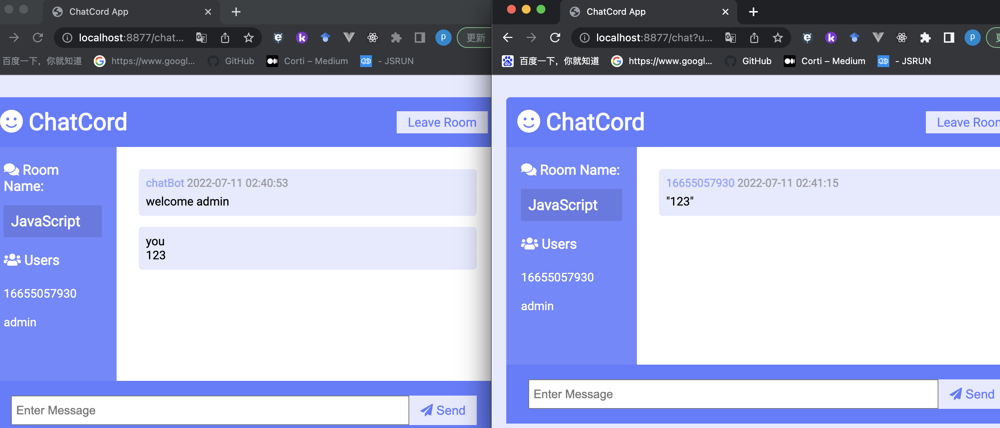

# chatgo

使用go和websocket实现一个简易的即时通讯应用，项目受到[chatcord](https://github.com/bradtraversy/chatcord)这个项目的启发，并且复用了该项目的前端页面。

## 本地测试

```shell
go run letter.go
```

打开 localhots:8877，输入username并选择房间room，此处room+username确定唯一一个websocket连接。

